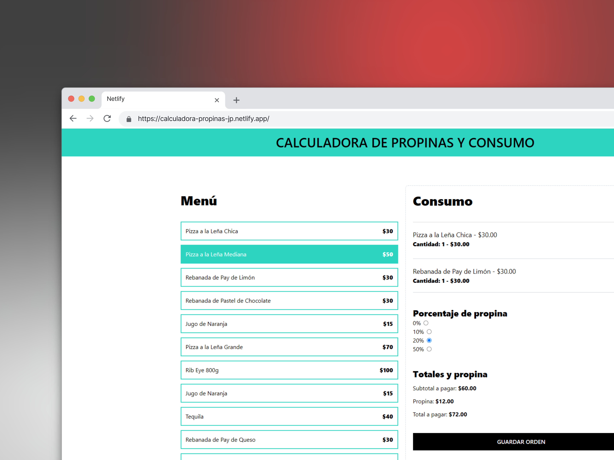

<a name="readme-top"></a>

<div align="center">

[![Contributors][contributors-shield]][contributors-url]
[![Forks][forks-shield]][forks-url]
[![Stargazers][stars-shield]][stars-url]
[![Issues][issues-shield]][issues-url]

<a href="https://github.com/Jesus-Puertos/calculadora-propinas">
  
</a>

## Calculadora de propinas en React con TypeScript:

Este proyecto fue realizado siguiendo el curso React y TypeScript - La Guía Completa Creando +10 Proyectos de Juan de La Torre. En este proyecto aprendi la diferencia en useMemo y useCallBack, tambien cree mi propio custom Hook y una función que me ayudo a formatear cantidadesa pesos mexicanos, tambien a mejorar el performance cuando no se muestren ciertos componentes.

El proyecto esta disponible en: [Ver proyecto](https://calculadora-propinas-jp.netlify.app/) 

[Reportar error](https://github.com/Jesus-Puertos/calculadora-propinas/issues) · [Sugerir algo](https://github.com/Jesus-Puertos/calculadora-propinas/issues)

</div>

<details>
<summary>Tabla de contenidos</summary>

1. [Características principales](#características-principales)
2. [Para empezar](#para-empezar)
   - [Prerequisitos](#prerequisitos)
   - [Instalación](#instalación)
3. [Contribuir al proyecto](#contribuir-al-proyecto)

</details>

## Características principales

- **Agregar ordenes**: Permite a los usuarios agregar ordenes de lo que se consumio del menú y hacer la suma del subtotal.
- **Calcular propinas**: Permite seleccionar la cantidad de propina a dejar y hacer el calculo correspondiente a lo establecido en el subtotal.
- **Eliminar ordenes**: Permite eliminar ordenes en caso de equivocación y actualizar los totales.
- **Calcular el total**: Permite hacer la suma del subtotal y la propina.
.

### Capturas de pantalla del proyecto:


<p align="right">(<a href="#readme-top">volver arriba</a>)</p>

## Para empezar

### Prerequisitos

- NPM

  ```sh
  npm install npm@latest -g
  ```

### Instalación

1. Clona el repositorio

   ```sh
   git clone https://github.com/Jesus-Puertos/herping-zoongolica-landing.git
   ```

2. Instala los paquetes de NPM

   ```sh
   npm install
   ```

3. Ejecuta el proyecto

   ```sh
   npm run dev
   ```

<p align="right">(<a href="#readme-top">volver arriba</a>)</p>

## Contribuir al proyecto

Este repositorio está destinado a este curso sin embargo si tienes algunas ideas y sugerencias y gustas implementarlas puedes hacerlo!! 🤗 , por favor sigue los siguientes pasos.

Aquí tienes una guía rápida:

1. Clona el repositorio original: git clone [_clone_](https://github.com/Jesus-Puertos/herping-zoongolica-landing.git)
2. Crea tu Rama de Funcionalidad (`git checkout -b feature/CaracteristicaIncreible`)
3. Añade tus cambios (`git add .`)
4. Realiza un commit de tus Cambios (`git commit -m 'Add: alguna CaracterísticaIncreible'`)
5. Haz Push a la Rama del repositorio original (`git push origin feature/CaracteristicaIncreible`)
6. Abre una [_pull request_](https://github.com/Jesus-Puertos/herping-zoongolica-landing/pulls)

Si en algún momento necesita actualizar su rama local con los cambios en la rama main del repositorio original, puede hacerlo con los siguientes comandos:

1. Cambia a la rama main: git checkout main
2. Actualiza la rama main: git pull origin main
3. Cambia de nuevo a tu rama de trabajo: git checkout feature/CaracteristicaIncreible
4. Integra los cambios de la rama main en tu rama de trabajo: git merge main

También puedes simplemente abrir un [_issue_](https://github.com/Jesus-Puertos/calculadora-propinas/issues) con la etiqueta "enhancement".

Por favor, consulta la [guía de contribución](https://github.com/Jesus-Puertos/calculadora-propinas/blob/master/CONTRIBUTING.md) para saber cómo puedes empezar de la mejor manera y siguiendo [buenas prácticas](https://github.com/Jesus-Puertos/calculadora-propinas/blob/main/CONTRIBUTING.md#buenas-prácticas-).

#

**¡Gracias a todos los miembros del equipo que estan haciendo esto posible!**

[](https://github.com/Jesus-Puertos/calculadora-propinas/graphs/contributors)

<p align="right">(<a href="#readme-top">volver arriba</a>)</p>


[contributors-shield]: https://img.shields.io/github/contributors/Jesus-Puertos/calculadora-propinas.svg?style=for-the-badge
[contributors-url]: https://github.com/Jesus-Puertos/calculadora-propinas/graphs/contributors
[forks-shield]: https://img.shields.io/github/forks/Jesus-Puertos/calculadora-propinas.svg?style=for-the-badge
[forks-url]: https://github.com/Jesus-Puertos/calculadora-propinas/network/members
[stars-shield]: https://img.shields.io/github/stars/Jesus-Puertos/calculadora-propinas.svg?style=for-the-badge
[stars-url]: https://github.com/Jesus-Puertos/calculadora-propinas/stargazers
[issues-shield]: https://img.shields.io/github/issues/Jesus-Puertos/calculadora-propinas.svg?style=for-the-badge
[issues-url]: https://github.com/Jesus-Puertos/calculadora-propinas/issues